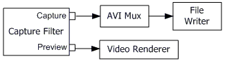
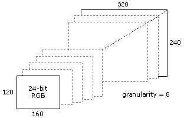

# Video Capture

[TOC]


## 一：介绍

进行音视频采集的Filter Graph叫做Capture Graph，通常Capture Graph比文件回放的Graph更加复杂，为了方便操作，封装了Capture Graph Builder用于辅助建立Graph。一般只需要使用**ICaptureGraphBuilder2::SetFiltergraph** 将Capture Graph Builder和Filter Graph Manager建立联系就可以了：


## 二：设备枚举

视频采集设备的枚举和音频采集设备的枚举类似，都是使用系统的枚举方法，可参照《Basic Tasks》#设备枚举。


## 三：Video Graph

### 3.1 视频预览

视频预览主要通过`ICaptureGraphBuilder2::RenderStream` 方法，如《Basic Tasks》介绍：

```c++
ICaptureGraphBuilder2 *pBuild; // Capture Graph Builder
// Initialize pBuild (not shown).

IBaseFilter *pCap; // Video capture filter.

/* Initialize pCap and add it to the filter graph (not shown). */

hr = pBuild->RenderStream(&PIN_CATEGORY_PREVIEW, &MEDIATYPE_Video, 
    pCap, NULL, NULL);
```

`RenderStream`的第一个参数指明Video Capture Filter的Pin类型；第二个参数指明媒体类型；后边三个参数为要连接的Filters，最后一个参数为NULL则表示使用默认的Renderer。

当Video Capture Filter并没有预览Output Pin时候Capture Graph Builder则会自动加入`Smart Tee Filter` 来增加预览接口。


### 3.2 录制视频到AVI文件


可以参考Audio Capture相关部分。

AVI Mux和File Writer的建立可以通过：

```c++
IBaseFilter *pMux;
hr = pBuild->SetOutputFileName(
    &MEDIASUBTYPE_Avi,  // Specifies AVI for the target file.
    L"C:\\Example.avi", // File name.
    &pMux,              // Receives a pointer to the mux.
    NULL);              // (Optional) Receives a pointer to the file sink.
```

效果等同于Audio Capture章节的手动创建效果。

之后连接Filters(Video Capture Filter->AVI Mux，AVI Mux->File Writer在setname时候已经自动连接)：

```c++
hr = pBuild->RenderStream(
    &PIN_CATEGORY_CAPTURE, // Pin category.
    &MEDIATYPE_Video,      // Media type.
    pCap,                  // Capture filter.
    NULL,                  // Intermediate filter (optional).
    pMux);                 // Mux or file sink filter.

// Release the mux filter.
pMux->Release();
```

如果同时采集视频和音频，可以选择主参考流(一般选择音频为主参考流)，也可以设置交错类型：

```c++
IConfigInterleaving *pInterleave = NULL;
hr = pMux->QueryInterface(IID_IConfigInterleaving, (void**)&pInterleave);
if (SUCCEEDED(hr))
{
    pInterleave->put_Mode(INTERLEAVE_CAPTURE);
    pInterleave->Release();
}

//
IConfigInterleaving *pInterleave = NULL;
hr = pMux->QueryInterface(IID_IConfigInterleaving, (void**)&pInterleave);
if (SUCCEEDED(hr))
{
    pInterleave->put_Mode(INTERLEAVE_CAPTURE);
    pInterleave->Release();
}
```

也可以保存编码后的流到AVI：

```c++
IBaseFilter *pEncoder;
/* Create the encoder filter (not shown). */
// Add it to the filter graph.
pGraph->AddFilter(pEncoder, L"Encoder);

/* Call SetOutputFileName as shown previously. */

// Render the stream.
hr = pBuild->RenderStream(&PIN_CATEGORY_CAPTURE, &MEDIATYPE_Video, 
    pCap, 
pEncoder, pMux);
pEncoder->Release();
```

### 3.3 录制视频到Windows Media File(ASF)


流程和录制到AVI文件类似：

```c++
// 创建ASF Filter
IBaseFilter* pASFWriter = 0;
hr = pBuild->SetOutputFileName(
    &MEDIASUBTYPE_Asf,   // Create a Windows Media file.
    L"C:\\VidCap.wmv",   // File name.
    &pASFWriter,         // Receives a pointer to the filter.
    NULL);  // Receives an IFileSinkFilter interface pointer (optional).

// 配置ASF Filter的Profile
IConfigAsfWriter *pConfig = 0;
hr = pASFWriter->QueryInterface(IID_IConfigAsfWriter, (void**)&pConfig);
if (SUCCEEDED(hr))
{
     // Configure the ASF Writer filter.
    pConfig->Release();
}

// 连接Filters
hr = pBuild->RenderStream(
    &PIN_CATEGORY_CAPTURE,   // Capture pin.
    &MEDIATYPE_Video,        // Video. Use MEDIATYPE_Audio for audio.
    pCap,                    // Pointer to the capture filter. 
    0, 
    pASFWriter);             // Pointer to the sink filter (ASF Writer).
```

### 3.4 录制视频到其他文件格式

录制到其他格式类似，需要在创建的时候指明CLSID：

```c++
IBaseFilter *pMux = 0;
IFileSinkFilter *pSink = 0;
hr = pBuild->SetOutputFileName(&CLSID_MyCustomMuxFilter, 
    L"C:\\VidCap.avi", &pMux, &pSink);
```

### 3.5 录制切换

当需要切换录制文件时操作为：

```c++
// Run -> Stop -> Changing file -> Run
IBaseFilter *pMux;
IFileSinkFilter *pSink
hr = pBuild->SetOutputFileName(&MEDIASUBTYPE_Avi, L"C:\\YourFileName.avi", 
    &pMux, &pSink);
if (SUCCEEDED(hr))
{
    hr = pBuild->RenderStream(&PIN_CATEGORY_CAPTURE, &MEDIATYPE_Video, 
        pCap, NULL, pMux);

    if (SUCCEEDED(hr))
    {
        pControl->Run();
        /* Wait awhile, then stop the graph. */
        pControl->Stop();
        // Change the file name and run the graph again.
        pSink->SetFileName(L"YourFileName02.avi", 0);
        pControl->Run();
    }
    pMux->Release();
    pSink->Release();
}
```

### 3.6 同时预览和录制

当同时需要预览和录制时只需要调用两次`RenderStream`:

```c++
// Render the preview stream to the video renderer.
hr = pBuild->RenderStream(&PIN_CATEGORY_PREVIEW, &MEDIATYPE_Video, pCap, 
    NULL, NULL);

// Render the capture stream to the mux.
hr = pBuild->RenderStream(&PIN_CATEGORY_CAPTURE, &MEDIATYPE_Video, pCap, 
    NULL, pMux);
```

如前面所述，Capture Graph Builder会根据需要加入**Smart Tee Filter**，可能的两种情况为：




## 四：Capture Graph控制

- **Filter Graph Manager：** `IMediaControl` 提供开始、暂停和结束控制；
- **Capture Graph Builder:**  `ICaptureGraphBuilder2::ControlStream` 提供对采集和预览流的单独控制。

```c++
// Control the video capture stream. 
REFERENCE_TIME rtStart = 10000000, rtStop = 50000000;
const WORD wStartCookie = 1, wStopCookie = 2;  // Arbitrary values.
hr = pBuild->ControlStream(
    &PIN_CATEGORY_CAPTURE, // Pin category.
    &MEDIATYPE_Video,      // Media type.
    pCap,                 // Capture filter.
    &rtStart, &rtStop,     // Start and stop times.
    wStartCookie, wStopCookie  // Values for the start and stop events.
);
pControl->Run();

//
while (hr = pEvent->GetEvent(&evCode, &param1, &param2, 0), SUCCEEDED(hr))
{
    switch (evCode)
    {
    case EC_STREAM_CONTROL_STARTED: 
    // param2 == wStartCookie
    break;

    case EC_STREAM_CONTROL_STOPPED: 
    // param2 == wStopCookie
    break;
    
    } 
    pEvent->FreeEventParams(evCode, param1, param2);
}
```

`ControlStream`的第四和第五个参数为流开始和结束的相对时间；第六和第七个参数为开始和结束事件触发时传递的参数。调整`ControlStream`的参数可以控制相应的流以及流时间。

> ControlStream使用Output Pin的IAMStreamControl接口，所以也可以直接使用IAMStreamControl接口来控制。


## 五：Video Capture Tasks

本节主要讲述Video Capture的其他任务。

### 5.1 配置采集设备

#### 5.1.1 显示VFW属性对话框

VFW属性对话框只支持使用Video for Windows(VFW)驱动的设备。步骤为：

1. 停止Filter Graph；
2. 查询`IAMVfwCaptureDialogs` 接口，查询成功则表示此设备是VFW设备；
3. 调用`IAMVfwCaptureDialogs::HasDialog` 查询是否支持属性对话框；
4. 如果支持则调用`IAMVfwCaptureDialogs::ShowDialog` 显示属性对话框；
5. 重新启动Filter Graph。

```c++
pControl->Stop(); // Stop the graph.

// Query the capture filter for the IAMVfwCaptureDialogs interface.
IAMVfwCaptureDialogs *pVfw = 0;
hr = pCap->QueryInterface(IID_IAMVfwCaptureDialogs, (void**)&pVfw);
if (SUCCEEDED(hr))
{
    // Check if the device supports this dialog box.
    if (S_OK == pVfw->HasDialog(VfwCaptureDialog_Source))
    {
        // Show the dialog box.
        hr = pVfw->ShowDialog(VfwCaptureDialog_Source, hwndParent);
    }
}
pControl->Run();
```

#### 5.1.2 配置视频属性

##### ProcAmp Settings

Windows Driver Model(WDM)类型的设备支持`IAMVideoProcAmp`相关控制：

- Backlight compensation
- Brightness
- Contrast
- Gain
- Gamma
- Hue
- Saturation
- Sharpness
- White balance

操作步骤如下：

1. 查询IAMVideoProcAmp接口；
2. 对于每个属性，调用 `IAMVideoProcAmp::GetRange` 方法，如果失败则表示不支持这个属性；如果成功则会返回相应范围，默认值，增长步长等；
3. 调用`IAMVideoProcAmp::Get` 获得属性当前值；
4. 调用`IAMVideoProcAmp::Set` 设置属性新的值。

**配置时候无需先停止Graph。**

```c++
HWND hTrackbar; // Handle to the trackbar control. 
// Initialize hTrackbar (not shown).

// Query the capture filter for the IAMVideoProcAmp interface.
IAMVideoProcAmp *pProcAmp = 0;
hr = pCap->QueryInterface(IID_IAMVideoProcAmp, (void**)&pProcAmp);
if (FAILED(hr))
{
    // The device does not support IAMVideoProcAmp, so disable the control.
    EnableWindow(hTrackbar, FALSE);
}
else
{
    long Min, Max, Step, Default, Flags, Val;

    // Get the range and default value. 
    hr = m_pProcAmp->GetRange(VideoProcAmp_Brightness, &Min, &Max, &Step,
        &Default, &Flags);
    if (SUCCEEDED(hr))
    {
        // Get the current value.
        hr = m_pProcAmp->Get(VideoProcAmp_Brightness, &Val, &Flags);
    }
    if (SUCCEEDED(hr))
    {
        // Set the trackbar range and position.
        SendMessage(hTrackbar, TBM_SETRANGE, TRUE, MAKELONG(Min, Max));
        SendMessage(hTrackbar, TBM_SETPOS, TRUE, Val);
        EnableWindow(hTrackbar, TRUE);
    }
    else
    {
        // This property is not supported, so disable the control.
        EnableWindow(hTrackbar, FALSE);
    }
}
```

##### Camera Settings

`由IAMCameraControl` 控制，类似`IAMVideoProcAmp` 接口，但是是控制相机本身属性：

- Exposure
- Focus
- Iris
- Pan
- Roll
- Tilt
- Zoom

操作步骤：

1. 查询`IAMCameraControl` 接口；
2. 调用 `IAMCameraControl::GetRange` 查询属性支持和默认范围、值等；
3. 调用`IAMCameraControl::Get ` 获得属性当前值；
4. 调用 `IAMCameraControl::Set ` 设置属性值。

#### 5.1.3 配置输出格式

由`IAMStreamConfig::GetFormat` 返回的`pmt`包含的`AM_MEDIA_TYPE`结构体记录了视频支持格式。

以下为旧的方法：

**IAMStreamConfig**接口记录了视频的格式信息，位于Video Capture Filter 的Output Pin上，可以通过以下方式查询：

```c++
IAMStreamConfig *pConfig = NULL;
hr = pBuild->FindInterface(
    &PIN_CATEGORY_PREVIEW, // Preview pin.
    0,    // Any media type.
    pCap, // Pointer to the capture filter.
    IID_IAMStreamConfig, (void**)&pConfig);
```

查询支持的格式数目：

```c++
int iCount = 0, iSize = 0;
hr = pConfig->GetNumberOfCapabilities(&iCount, &iSize);

// Check the size to make sure we pass in the correct structure.
if (iSize == sizeof(VIDEO_STREAM_CONFIG_CAPS))
{
    // Use the video capabilities structure.

    for (int iFormat = 0; iFormat < iCount; iFormat++)
    {
        VIDEO_STREAM_CONFIG_CAPS scc;
        AM_MEDIA_TYPE *pmtConfig;
        hr = pConfig->GetStreamCaps(iFormat, &pmtConfig, (BYTE*)&scc);
        if (SUCCEEDED(hr))
        {
            /* Examine the format, and possibly use it. */

            // Delete the media type when you are done.
            DeleteMediaType(pmtConfig);
        }
}
```

设置格式：

```c++
hr = pConfig->SetFormat(pmtConfig);
```

pmtConfig包括了允许的最大最小分辨率和步长，所以可以根据需要重新设定范围内的分辨率：



### 5.2 CrossBars

略

### 5.3 插拔消息

设备丢失时，Filter Graph Manager会发送**EC_DEVICE_LOST** 消息，设备再次可用时会再次发送此消息。当新设备加入时，Filter Graph Manager不会产生任何通知，可以通过Windows SDK监听**WM_DEVICECHANGE** 消息来确定是否有新设备加入。

### 5.4 静态图片捕捉

如何捕获高质量的静态图片，使用 `Sample Grabber Filter` 获得回调的视频数据。

略。

